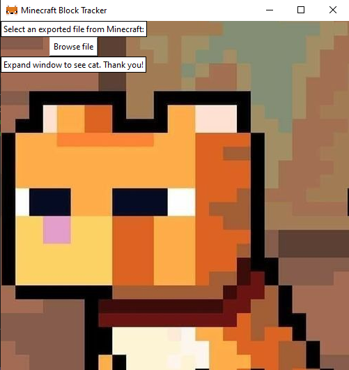
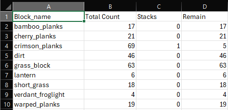

# Minecraft Block Tracker
Minecraft Block Tracker is a small CLI tool (with a tiny bit of GUI) that parses a ```.mcstructure``` file exported from a structure block in Creative Mode.
It tells you exactly how many of each block type appear in the build — perfect for planning material gathering in Survival or Hardcore worlds.
## Prequisites:
- Turn on cheat mode in creative world
- In chat box enter command: ```/give @s structure_block```
- Put the structure_block next to the buiding. Make sure the building is inside the borders 
- Click on structure_block, give the name to the build and save the structure.
- Export the file
## Clone repo:
In your terminal enter:
```
git clone https://github.com/swissymissy/MCBlockTracker.git
```
<br>The repo will be cloned to your local computer
## Install dependencies:
The program needs ```mcstructure``` library to read the binary file exported from Minecraft
<br>In terminal enter:
```
pip install -r requirements.txt
```
This will install the library ```mcstructure```
## Run program:
Go to ```/src``` folder. In terminal enter:
```
cd src
python main.py
```
## GUI preview

## Sample CSV output

<br> I hope you find the tool useful ! Thank you :> 
